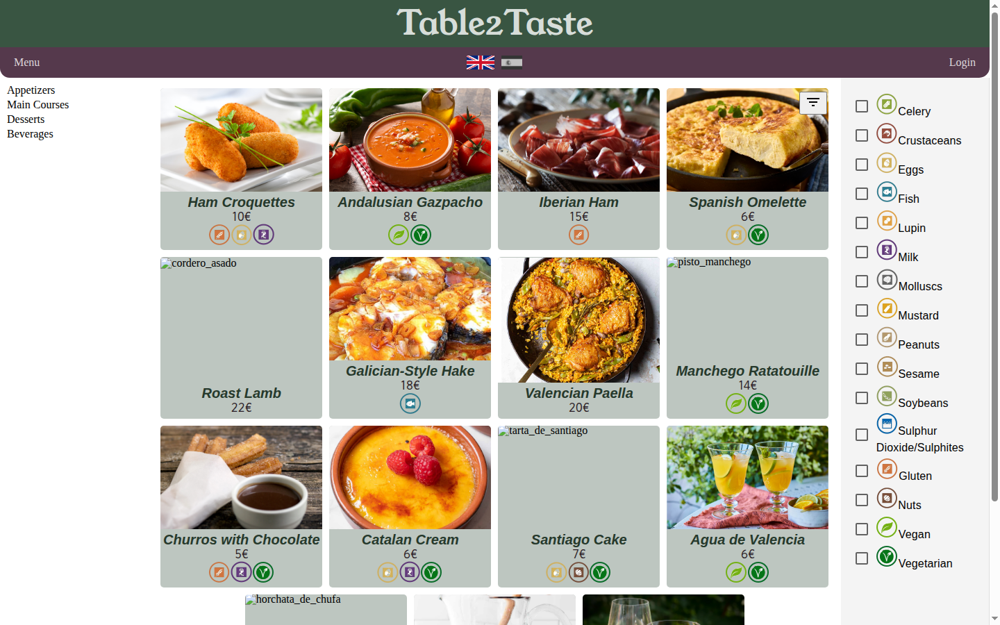
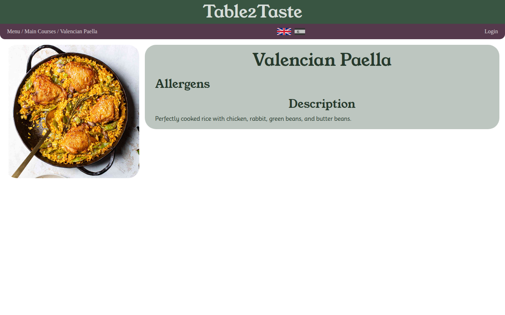
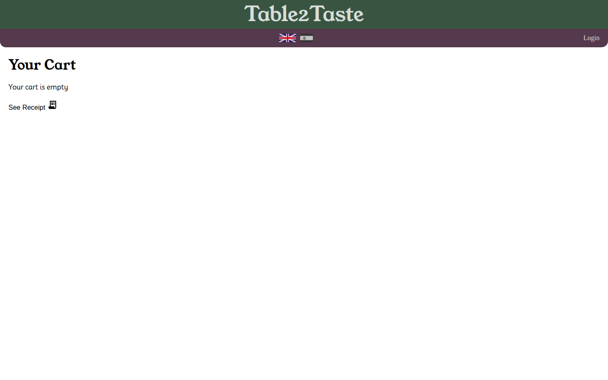
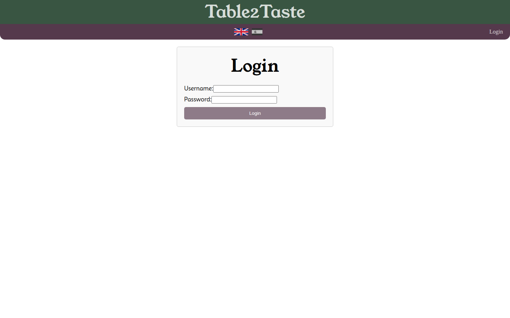
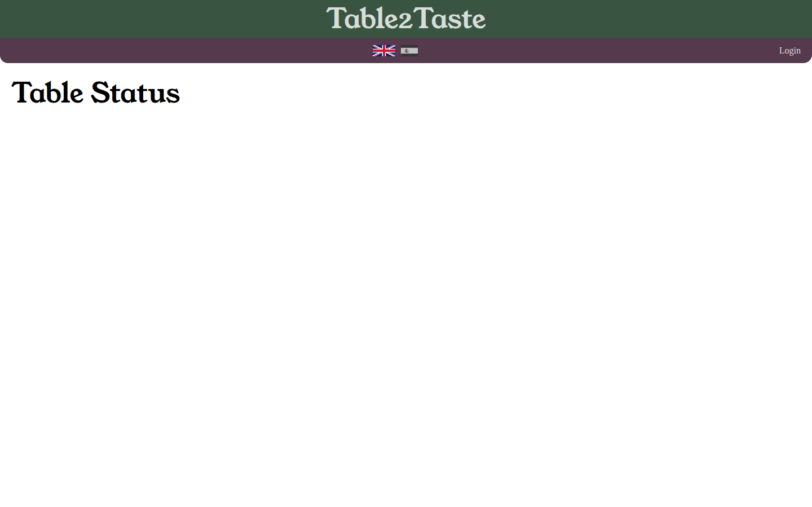

# Table2Taste

> Menu digital con QR para restaurantes. Los clientes escanean, ven el menu en su idioma, piden y pagan desde el movil.

## Architecture

```
Browser (React SPA)  →  nginx (Reverse Proxy)  →  Spring Boot API (JPA/Hibernate)  →  PostgreSQL
                          ↕ WebSocket
                     Ticket Printer
```

## Repository Structure (Monorepo)

```
table2taste/
├── docker-compose.yml           ← Orchestracion con health checks
├── .env.example                 ← Template de variables de entorno
├── packages/
│   ├── frontend/                ← React SPA (TypeScript, MUI 5)
│   ├── backend/                 ← Spring Boot 3.2.5 API (Java 17)
│   └── db/                      ← PostgreSQL + init scripts
└── docs/
    ├── architecture.html        ← Diagrama de arquitectura interactivo
    ├── diagram.svg              ← Diagrama de arquitectura
    └── screenshots/             ← Capturas de pantalla
```

## Tech Stack

| Layer | Technology |
|-------|-----------|
| Frontend | React 18, TypeScript, MUI 5, react-router-dom v6, axios |
| Backend | Spring Boot 3.2.5, Java 17, JPA/Hibernate, Spring Security, JWT |
| Database | PostgreSQL 16 |
| Real-time | WebSocket (Ticket Printer) |
| Logging | Logstash Logback (JSON estructurado en prod) |
| Infra | Docker Compose, nginx, health checks |

## Features

- Menu multilingue (20 idiomas precargados)
- Alergenos por plato (14 tipos)
- Carrito de compra con selector de mesa
- Estado de mesa / cuenta en tiempo real
- Administracion CRUD de menu, categorias y platos
- Autenticacion JWT
- Logging JSON estructurado
- Health checks en servicios (DB, Backend, Frontend)
- Variables de entorno externalizadas (sin secrets en codigo)

## Quick Start

```bash
git clone git@github.com:cabrasky/table2taste.git
cd table2taste
cp .env.example .env   # y editar con tus credenciales
docker compose up -d
```

Frontend: http://localhost:3000
API: http://localhost:8080
Swagger: http://localhost:8080/swagger-ui.html

## Screenshots

<p align="center">
  
  
</p>
<p align="center">
  
  
</p>
<p align="center">
  
  
</p>

## Environment Variables

| Variable | Default | Description |
|----------|---------|-------------|
| `POSTGRES_USER` | `table-2-taste` | DB user |
| `POSTGRES_PASSWORD` | *(required)* | DB password |
| `POSTGRES_DB` | `table2taste` | DB name |
| `DB_URL` | `jdbc:postgresql://db:5432/table2taste` | JDBC connection string |
| `JWT_SECRET` | *(required)* | JWT signing key |
| `JWT_EXPIRATION_MS` | `3600000` | JWT expiry in ms |
| `TABLE_PASSWORD` | *(required)* | Default table access password |
| `DEFAULT_LANGUAGE` | `es` | Default menu language |
| `SPRING_PROFILES_ACTIVE` | *(empty)* | Set to `dev` for human-readable logs |

## Health Checks

| Service | Check | Start Period |
|---------|-------|:-----------:|
| db | `pg_isready` | 30s |
| backend | `GET /actuator/health` | 60s |
| frontend | `curl localhost:80` | 30s |

## License

Apache 2.0

