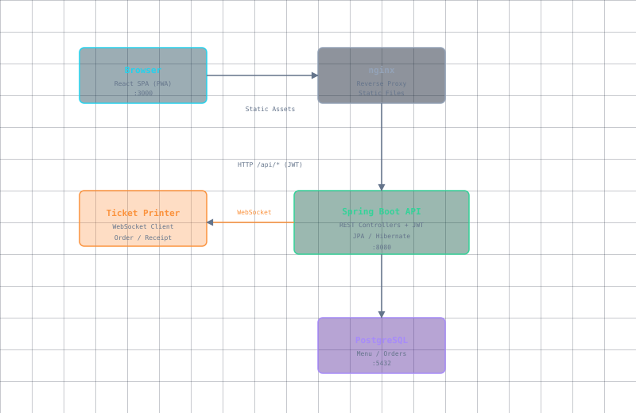

# Table2Taste

> QR-basierte digitale menukarte fur Restaurants. Gaste scannen den QR-Code an ihrem Tisch und sehen die Speisekarte in ihrer Sprache, bestellen und bezahlen direkt vom Handy.

## Table of Contents

- [About](#about)
- [Architecture](#architecture)
- [Repository Structure](#repository-structure)
- [Tech Stack](#tech-stack)
- [Quick Start](#quick-start)
- [Screenshots](#screenshots)

## About

Table2Taste verwandelt jeden Restauranttisch in einen digitalen Bestellpunkt. Keine Papierkarten mehr, kein Warten auf den Kellner. Die Gaste scannen einen QR-Code, wahlen aus der Karte in 20 Sprachen aus, sehen Allergene und geben Bestellungen direkt auf, die in der Kuche ausgedruckt werden.

### Key Features

- **QR-basierter Zugang** — Jeder Tisch hat einen eindeutigen QR-Code
- **Multi-lingual** — Menuitems in 20 Sprachen ubersetzt
- **Allergen-Kennzeichnung** — 14 EU-Allergene mit Icons
- **Echtzeit-Bestellungen** — WebSocket-Verbindung zum Ticket-Drucker
- **Kategorien-Baum** — Verschachtelte Kategorien (z.B. Getranke > Wein > Rotwein)
- **Admin-Panel** — CRUD fur Kategorien, Menu-Items, Benutzer, Preise
- **Tischverwaltung** — Status (frei/besetzt), Service-Zuordnung, Rechnungen

## Architecture



```
                    ┌─────────────┐
                    │   Browser   │  React SPA (PWA)
                    │   :3000     │
                    └──────┬──────┘
                           │ Static Assets
                    ┌──────▼──────┐
                    │   nginx     │  Reverse Proxy
                    └──────┬──────┘
                           │ HTTP /api/* (JWT)
                    ┌──────▼──────┐      ┌──────────────────┐
                    │ Spring Boot │◄────►│ Ticket Printer   │
                    │   :8080     │  WS  │ (WebSocket)      │
                    └──────┬──────┘      └──────────────────┘
                           │ JDBC
                    ┌──────▼──────┐
                    │ PostgreSQL  │
                    │   :5432     │
                    └─────────────┘
```

### Data Flow

1. **Guest** scans QR code → loads React SPA via nginx
2. **React app** calls REST API (`/api/*`) with JWT token
3. **Spring Boot** handles auth, menu queries, order processing
4. **PostgreSQL** stores all data (menu, translations, orders, users)
5. **New orders** are pushed via WebSocket to the kitchen ticket printer
6. **Admin** manages the menu through the same interface

## Repository Structure

```
table2taste/
├── docker-compose.yml         ← Orchestration (orchestriert alles)
├── diagram.svg                ← Architecture diagram
├── architecture.html          ← Interactive HTML diagram
├── table2taste-frontend/      ← React SPA (QR menu)
├── table2taste-backend_springboot/  ← Spring Boot REST API
└── table2taste-db/            ← PostgreSQL init
```

| Repository | Description | Language |
|------------|-------------|----------|
| `table2taste-frontend` | React 18 SPA with MUI 5, TypeScript, i18n | TypeScript |
| `table2taste-backend_springboot` | REST API, JPA, WebSocket, JWT auth | Java 17 |
| `table2taste-db` | PostgreSQL 16 schema & initialization | SQL |

## Tech Stack

| Layer | Technology |
|-------|-----------|
| **Frontend** | React 18, TypeScript, MUI 5, react-router-dom v6, axios, react-toastify |
| **Backend** | Spring Boot 3.2.5, Java 17, Maven, JPA/Hibernate, Spring Security |
| **Database** | PostgreSQL 16 |
| **Auth** | JWT (jjwt), BCrypt |
| **API Docs** | Springdoc OpenAPI (Swagger) |
| **Real-time** | WebSocket (kitchen ticket printer) |
| **Infrastructure** | Docker Compose, nginx (reverse proxy) |

## Quick Start

### Prerequisites

- Docker & Docker Compose
- Git

### Setup

1. Clone the repository:

```bash
git clone --recurse-submodules git@github.com:cabrasky/table2taste.git
cd table2taste
```

2. Create a `.env` file with database credentials:

```env
POSTGRES_USER=table-2-taste
POSTGRES_PASSWORD=<your-password>
POSTGRES_DB=table2taste
```

3. Start all services:

```bash
docker compose up -d
```

4. Access the application:

- Frontend: `http://localhost:3000`
- API: `http://localhost:8080`
- Swagger: `http://localhost:8080/swagger-ui.html`

### Default Admin Access

On first startup, the system seeds default data including an admin account. Check the `defaultData.json` file in the backend for default credentials.

## Screenshots

> _(Screenshots werden hier eingefugt)_
>
> Screenshots of the main menu view, item detail with allergens, cart page, admin panel, and table status screen.
